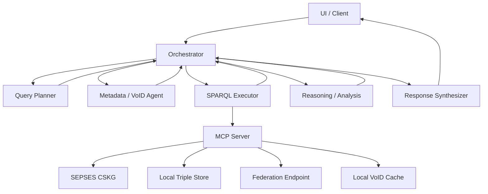
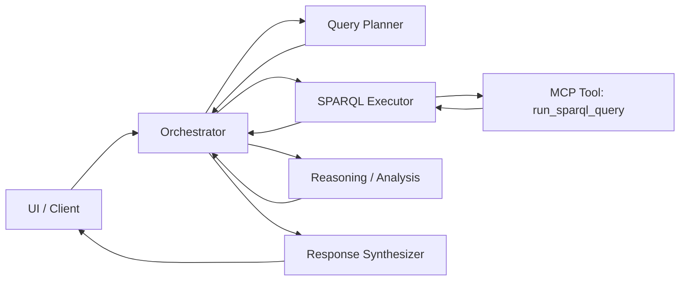

# Multi-Agent Workflow Architecture

## Overview
This document defines the multi-agent workflow for natural-language to SPARQL execution against CSKG endpoints, and the communication protocol between agents.

## Agent roles

### Orchestrator (recommended)
- Owns the end-to-end flow and state (trace id, retries, and timeouts).
- Routes tasks to specialized agents based on intent.
- Enforces guardrails (max tokens, max query size, endpoint allowlist).

### Query Planner Agent
- Input: natural language question, user context, and available endpoints.
- Output: SPARQL query plan, including target endpoint(s), prefixes, and expected variables.
- Responsibilities:
  - Choose endpoint(s) and constraints.
  - Ensure SPARQL uses SERVICE when federating.
  - Provide fallback queries if the primary query fails.

### SPARQL Executor Agent
- Input: SPARQL query and execution parameters.
- Output: raw results and execution metadata (elapsed ms, row count, errors).
- Responsibilities:
  - Call MCP tool `run_sparql_query`.
  - Handle retries and timeouts based on policy.

### Reasoning / Analysis Agent
- Input: raw SPARQL results and query plan.
- Output: normalized facts, aggregations, and key findings.
- Responsibilities:
  - Validate result completeness.
  - Transform raw bindings into structured findings.
  - Flag missing or ambiguous results.

### Response Synthesizer Agent
- Input: structured findings and supporting evidence.
- Output: user-facing answer with references to evidence.
- Responsibilities:
  - Generate concise explanations.
  - Include the generated SPARQL query if transparency is needed.

### Metadata / VoID Agent (optional)
- Input: endpoint URL(s).
- Output: VoID and service description metadata.
- Responsibilities:
  - Call MCP tool `get_void_descriptions`.
  - Cache and surface dataset metadata to improve query planning.

## Data layer and endpoints

- Remote CSKG endpoint (SEPSES): `https://sepses.ifs.tuwien.ac.at/sparql`.
- Local triple store (optional): Virtuoso or Qlever on `http://localhost:8890/sparql` or `http://localhost:7019/sparql`.
- Federator (optional): `FEDERATION_ENDPOINT` for multi-`SERVICE` queries.
- Local VoID cache: `LOCAL_STORE` for cached dataset descriptions.

## Data flow

1. UI sends natural language query to the Orchestrator.
2. Orchestrator sends a planning task to Query Planner.
3. Query Planner returns a SPARQL plan + query and selects endpoint routing.
4. Orchestrator sends the query to SPARQL Executor with routing constraints.
5. SPARQL Executor runs `run_sparql_query` via MCP and returns raw results.
6. Orchestrator sends results to Reasoning / Analysis.
7. Reasoning / Analysis returns structured findings.
8. Response Synthesizer crafts the final response for the UI.





## Agent communication protocol

### Transport
- Internal agent messages use a shared JSON envelope.
- SPARQL execution uses MCP `tools/call` with JSON-RPC over stdio.

### Message envelope (internal)

```json
{
  "trace_id": "uuid",
  "from": "planner",
  "to": "executor",
  "intent": "execute_sparql",
  "input": {
    "query": "SELECT ..."
  },
  "context": {
    "user_query": "Find relationships between Emotet and CVE-2023-1234",
    "endpoint_policy": "allowlist",
    "routing": {
      "default_endpoint": "https://sepses.ifs.tuwien.ac.at/sparql",
      "federation_endpoint": "http://localhost:3030/ds/sparql",
      "force_federation": false
    }
  },
  "constraints": {
    "timeout_ms": 30000,
    "max_rows": 1000,
    "verify_ssl": true
  },
  "expected_output": {
    "type": "sparql_results_json"
  }
}
```

### Error payload

```json
{
  "trace_id": "uuid",
  "from": "executor",
  "to": "orchestrator",
  "intent": "error",
  "error": {
    "code": "SPARQL_TIMEOUT",
    "message": "Request timed out",
    "recoverable": true
  }
}
```

### MCP tool call contract
- Tool: `run_sparql_query`
- Arguments:
  - `query` (required)
  - `format` (optional)
  - `timeout_ms` (optional)
- Result:
  - preview text and full payload from the server

## Notes
- If a remote endpoint has TLS issues, use `SPARQL_CA_BUNDLE` or temporarily set `SPARQL_VERIFY_SSL=false` for local testing only.
- Keep a per-request `trace_id` to correlate logs across agents.
- Prefer `SERVICE` only when the planner explicitly needs remote endpoints; otherwise use `DEFAULT_SPARQL_ENDPOINT`.
