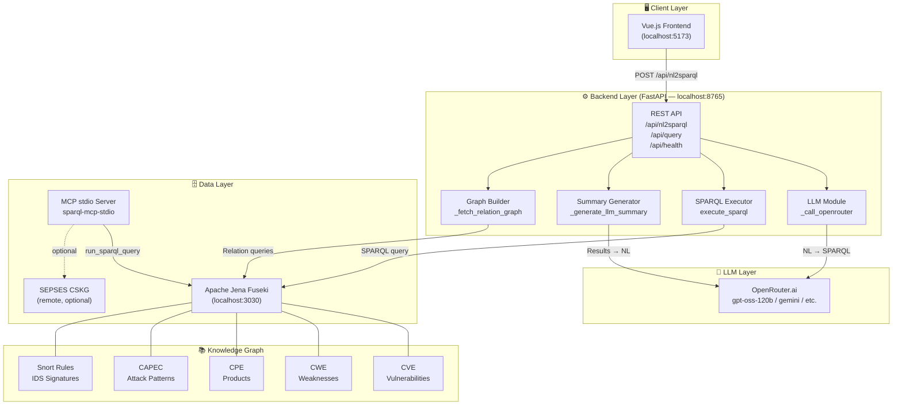
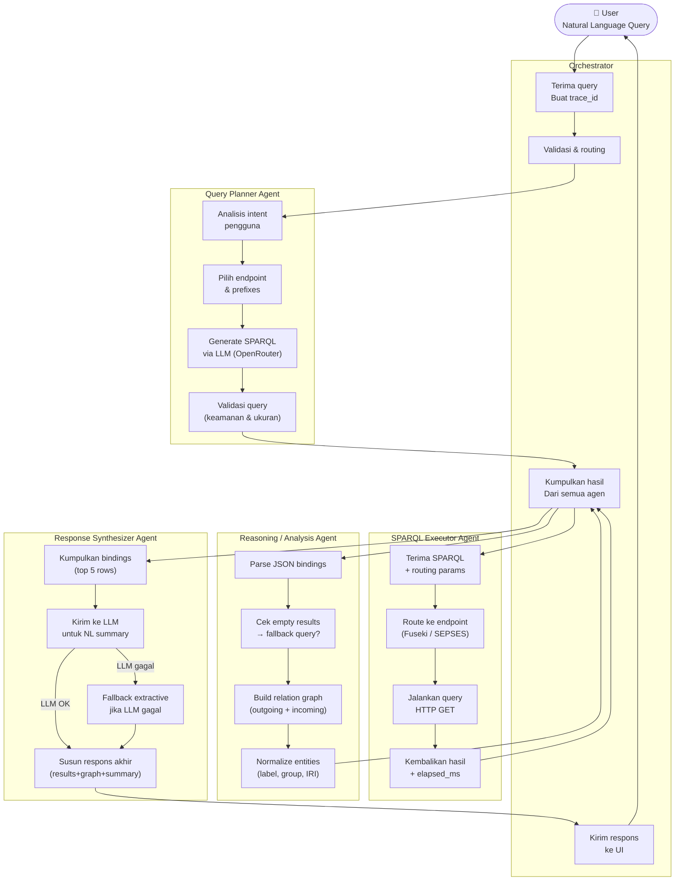
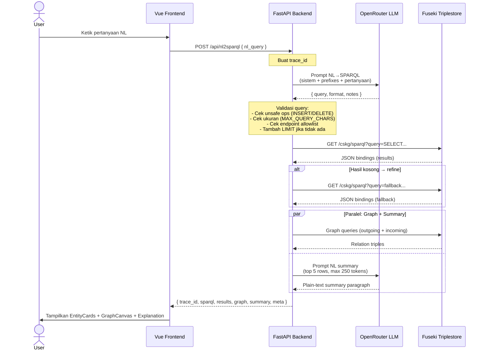
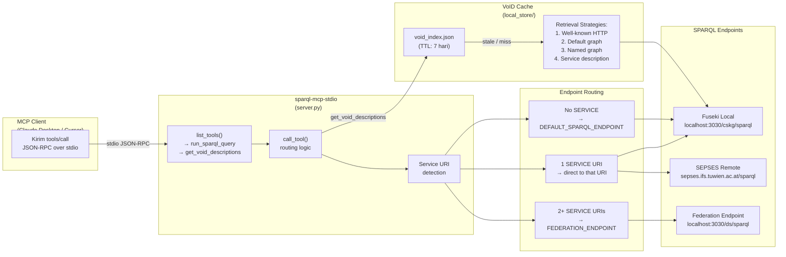
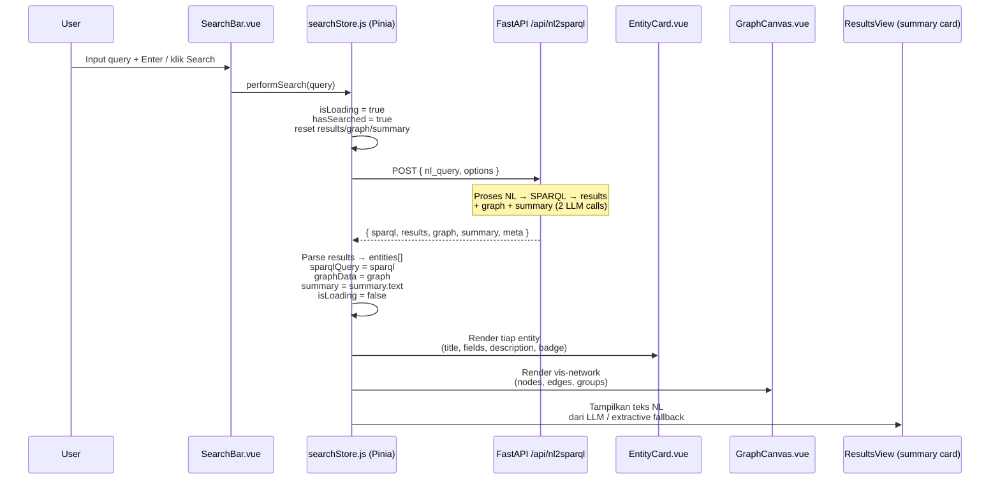
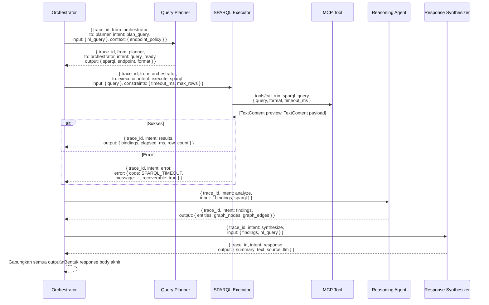
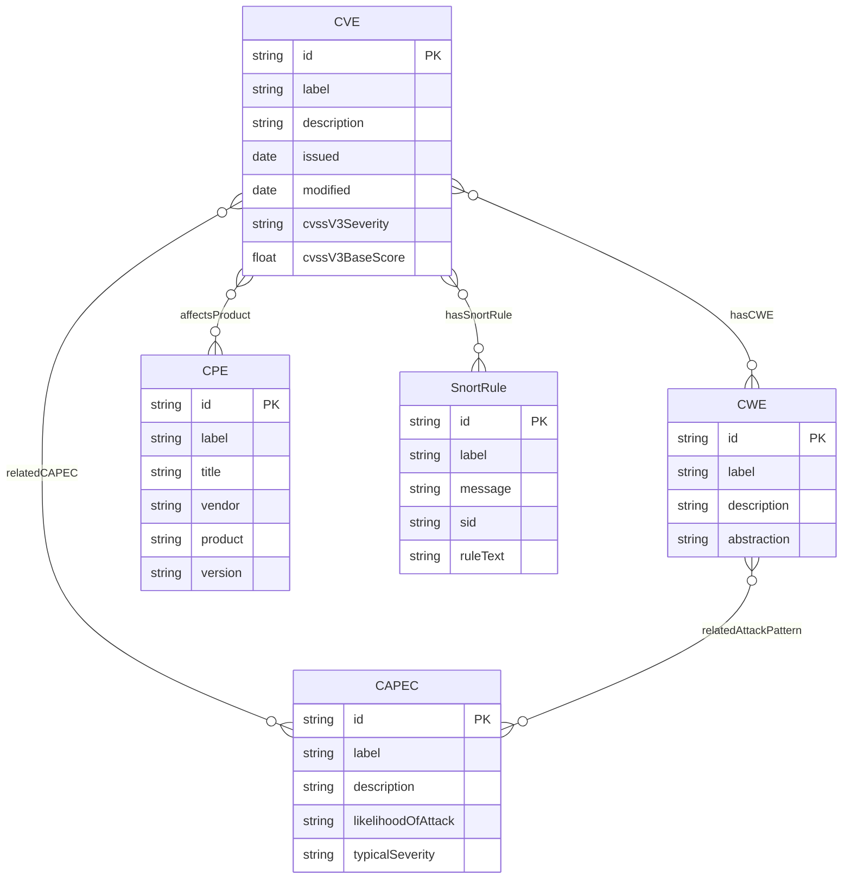
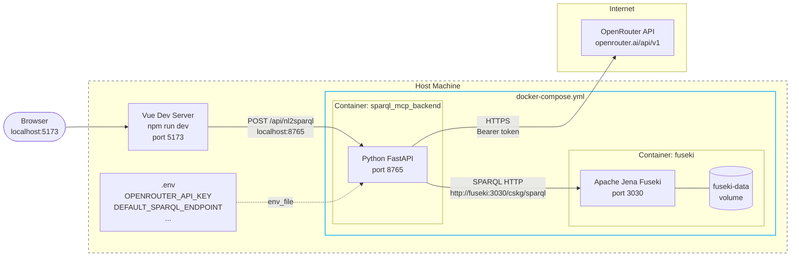
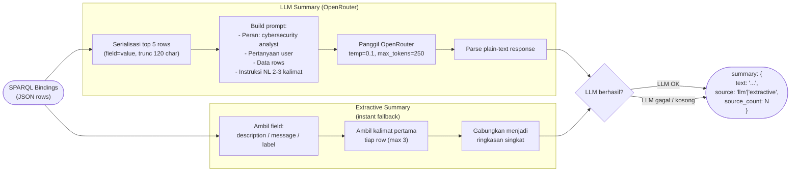

# System Architecture & Workflow Diagrams

Dokumen ini berisi diagram arsitektur dan alur kerja seluruh sistem SPARQL-MCP-Kel-2, mulai dari komponen high-level hingga detail komunikasi antar agen.

---

## 1. System Overview — Arsitektur High-Level

Gambaran besar seluruh komponen sistem dan hubungan di antaranya.



---

## 2. Multi-Agent Workflow — Alur Antar Agen

Setiap permintaan NL melewati rangkaian agen berikut secara berurutan.



---

## 3. NL to SPARQL — Alur Lengkap End-to-End

Sequence diagram dari saat pengguna mengetik query hingga UI menampilkan hasil.



---

## 4. SPARQL-MCP Integration — Integrasi MCP Server

Bagaimana MCP stdio server berinteraksi dengan triplestore dan klien MCP.



---

## 5. Frontend–Backend Interaction — Komunikasi UI & API

Detail interaksi komponen Vue.js dengan backend FastAPI.



---

## 6. Fallback Query Decision Tree — Logika Fallback

Alur keputusan saat LLM gagal menghasilkan query valid atau query menghasilkan hasil kosong.

```mermaid
flowchart TD
    START(["Query NL masuk"])

    LLM_CALL["Panggil LLM\n_call_openrouter"]
    LLM_OK{LLM berhasil?}
    QUERY_VALID{Query mengandung\nkata umum\n(tell/list/show)?}
    GENERIC{Query terlalu\ngenerik?\n_query_looks_too_generic}

    FALLBACK_BUILD["Bangun fallback query\n_build_fallback_query"]

    subgraph FALLBACK_LOGIC["Logika Fallback berdasarkan kata kunci NL"]
        F_CVE["CVE / vulnerabil\n→ SELECT CVE query\n+ filter label/desc"]
        F_CWE["CWE / weakness\n→ SELECT CWE query"]
        F_CPE["CPE / product / vendor\n→ SELECT CPE query"]
        F_CAPEC["CAPEC / attack pattern\n→ SELECT CAPEC query"]
        F_SNORT["snort / rule / signature\n→ SELECT SnortRule query"]
        F_MALWARE["malware+cve+cpe\n→ UNION multi-type query"]
        F_GENERIC["Generic\n→ CONTAINS label filter"]
    end

    EXEC["Eksekusi SPARQL\nexecute_sparql"]
    EXEC_OK{Eksekusi berhasil?}
    SAFE_RETRY["Retry dengan\nsafe CVE query\n(filter fallback_term)"]

    EMPTY{Hasil kosong?\n_is_empty_results}
    REFINE["Jalankan fallback query\nuntuk refinement"]

    FINAL(["Kembalikan hasil\nke Reasoning Agent"])

    START --> LLM_CALL
    LLM_CALL --> LLM_OK
    LLM_OK -->|"Tidak"| FALLBACK_BUILD
    LLM_OK -->|"Ya"| QUERY_VALID
    QUERY_VALID -->|"Ya (tidak valid)"| FALLBACK_BUILD
    QUERY_VALID -->|"Tidak (valid)"| GENERIC
    GENERIC -->|"Ya"| FALLBACK_BUILD
    GENERIC -->|"Tidak"| EXEC

    FALLBACK_BUILD --> F_MALWARE
    FALLBACK_BUILD --> F_CVE
    FALLBACK_BUILD --> F_CWE
    FALLBACK_BUILD --> F_CPE
    FALLBACK_BUILD --> F_CAPEC
    FALLBACK_BUILD --> F_SNORT
    FALLBACK_BUILD --> F_GENERIC
    F_MALWARE & F_CVE & F_CWE & F_CPE & F_CAPEC & F_SNORT & F_GENERIC --> EXEC

    EXEC --> EXEC_OK
    EXEC_OK -->|"Tidak"| SAFE_RETRY
    EXEC_OK -->|"Ya"| EMPTY
    SAFE_RETRY --> EMPTY

    EMPTY -->|"Ya"| REFINE
    EMPTY -->|"Tidak"| FINAL
    REFINE --> FINAL
```

---

## 7. Agent Communication Protocol — Protokol Pesan Antar Agen

Format envelope JSON yang digunakan untuk komunikasi internal antar agen.



---

## 8. Data Layer — Model Data Knowledge Graph

Entitas-entitas yang tersimpan di Fuseki dan hubungannya.



---

## 9. Deployment — Topologi Container Docker

Konfigurasi container saat dijalankan dengan `docker compose up`.



---

## 10. Summary Generation Pipeline — Alur Pembuatan Ringkasan

Detail proses pembuatan penjelasan NL dari hasil SPARQL.


